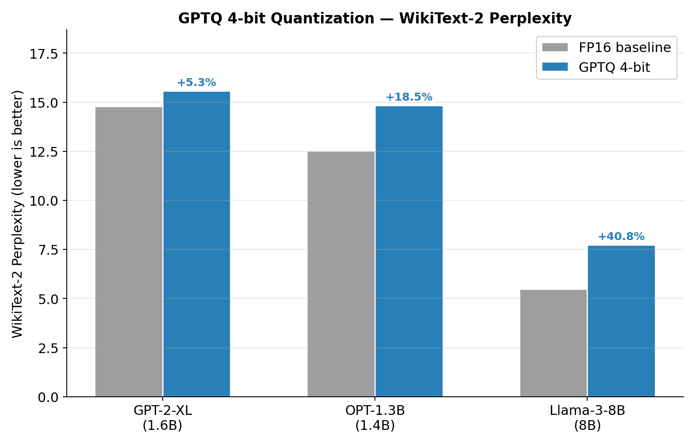
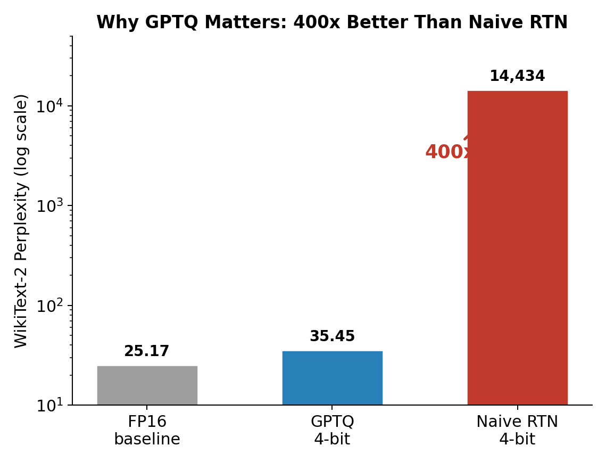
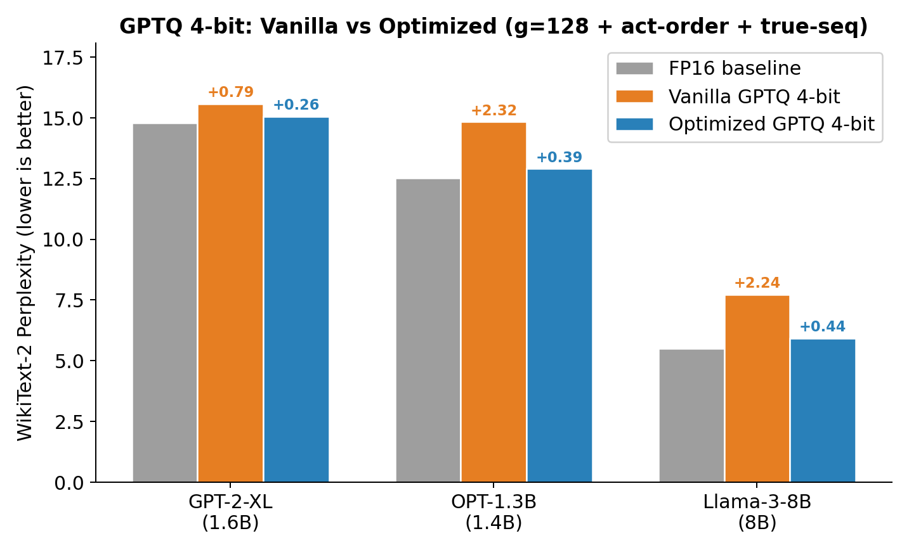
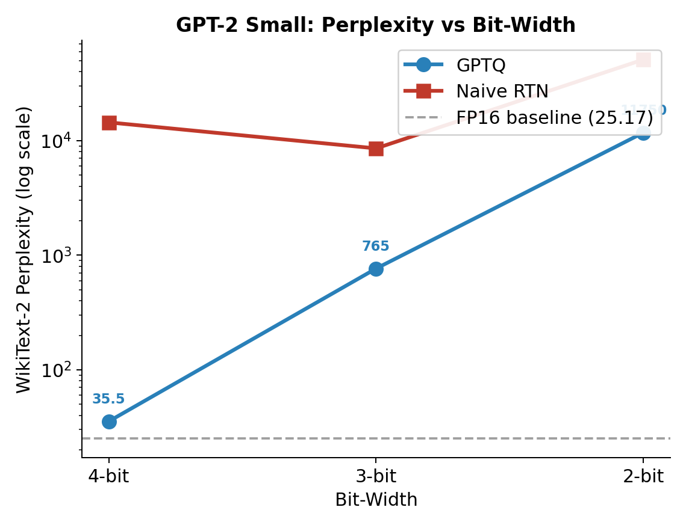
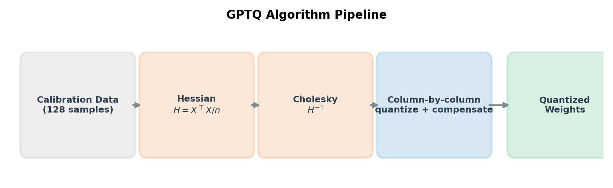

# GPTQ From Scratch

[](https://github.com/Azimml/gptq-from-scratch/actions/workflows/ci.yml)
[](LICENSE)
[](https://www.python.org)
[](https://pytorch.org)
[]()

A clean, from-scratch implementation of the **GPTQ post-training quantization algorithm** ([Frantar et al., 2022](https://arxiv.org/abs/2210.17323)) in PyTorch. No external quantization libraries — every component is written explicitly, from Hessian approximation to Cholesky-based weight updates.

Supports **GPT-2, OPT, LLaMA, Mistral, and Qwen2** architectures with automatic detection, plus three optimization techniques from the paper: grouping, act-order, and true-sequential.

**What this repository implements:**
- The complete GPTQ algorithm from scratch — Hessian approximation, Cholesky inverse, and column-wise error compensation.
- Multi-architecture support with auto-detection, isolated behind a small `ArchConfig` abstraction.
- Three optimizations from the paper (grouping, act-order, true-sequential), each toggled from the CLI.
- A memory-efficient, block-by-block calibration loop that scales from GPT-2 (124M) to Llama-3-8B.
- A pytest test suite covering the quantization primitives, the GPTQ numerics, architecture accessors, and a full offline end-to-end smoke test — run on every push by GitHub Actions.

## Table of Contents
- [Results](#results)
- [Background](#background)
- [Supported Architectures](#supported-architectures)
- [Implementation Details](#implementation-details)
- [Optimizations](#optimizations)
- [Quick Start](#quick-start)
- [Testing & Development](#testing--development)
- [Troubleshooting](#troubleshooting)
- [Limitations](#limitations)
- [References](#references)

## Results

### Vanilla GPTQ 4-bit

WikiText-2 perplexity (lower is better):

| Model | Params | FP16 | GPTQ 4-bit | Delta | Delta % |
|-------|--------|------|------------|-------|---------|
| GPT-2 | 124M | 25.17 | 35.45 | +10.28 | +40.9% |
| GPT-2-XL | 1.6B | 14.79 | 15.58 | +0.79 | +5.3% |
| OPT-1.3B | 1.4B | 12.51 | 14.83 | +2.32 | +18.5% |
| Llama-3-8B | 8B | 5.49 | 7.73 | +2.24 | +40.8% |



Naive round-to-nearest (RTN) on GPT-2 gives **14,434 PPL** vs **35.45 for GPTQ** — a ~400x gap that shows why error compensation matters.



> Larger models quantize better: GPT-2-XL loses only 5.3% at 4-bit. This is consistent with the trend reported in Frantar et al. (2022).

### Optimized GPTQ 4-bit (grouping g=128 + act-order + true-sequential)

| Model | Params | FP16 | Vanilla | Optimized | Improvement |
|-------|--------|------|---------|-----------|-------------|
| GPT-2-XL | 1.6B | 14.79 | 15.58 (+0.79) | 15.05 (+0.27) | ~3x closer to FP16 |
| OPT-1.3B | 1.4B | 12.51 | 14.83 (+2.32) | 12.90 (+0.39) | ~6x closer to FP16 |
| Llama-3-8B | 8B | 5.49 | 7.73 (+2.24) | 5.93 (+0.44) | ~5x closer to FP16 |



> With all three optimizations enabled the deltas approach those in the original paper (e.g. +0.39 on OPT-1.3B here vs +0.84 reported by Frantar et al.). Baselines differ because calibration uses WikiText-2 rather than the paper's C4.

### Extreme quantization on GPT-2 small

| Method | 4-bit | 3-bit | 2-bit |
|:--|--:|--:|--:|
| FP16 baseline | 25.18 | 25.18 | 25.18 |
| **GPTQ** | **34.56** | **765.03** | **11749.80** |
| Naive RTN | 14413.81 | 8559.39 | 51045.48 |



> Below 4-bit, even GPTQ degrades sharply on a 124M model — a known limitation at extreme compression on small models. GPTQ nevertheless stays orders of magnitude ahead of RTN at every bit-width.

## Background

### The quantization problem

Large language models are expensive to deploy. A 7B-parameter model in FP16 needs ~14 GB of memory; quantizing to 4-bit integers cuts that to ~3.5 GB, enabling inference on consumer hardware. But naive quantization (rounding each weight independently) accumulates catastrophic error, especially at low bit-widths.

### Why GPTQ works

GPTQ builds on **Optimal Brain Quantization** (OBQ), framing weight quantization as a layer-wise optimization problem. Given a weight matrix $W$ and the Hessian of the layer's reconstruction loss $H = X^\top X$, GPTQ finds quantized weights $\hat{W}$ that minimize

$$\lVert WX - \hat{W}X \rVert_2^2 = (w - \hat{w})^\top H\, (w - \hat{w}).$$

The key idea: after quantizing column $j$, **compensate** by adjusting all remaining unquantized columns using the inverse Hessian. This propagates the quantization error optimally across the matrix instead of letting it accumulate.

### Algorithm



```text
for each column block B:
    for each column j in B:
        1. Quantize:        q_j = round(w_j / scale) * scale
        2. Compute error:   delta = (w_j - q_j) / [H^-1]_jj
        3. Compensate:      W[:, j+1:] -= delta * [H^-1]_{j, j+1:}
    Lazy batch update:      W[:, after B] -= Errors @ H^-1[B, after B]
```

Three ingredients make this practical at scale:
1. **Hessian approximation** — $H \approx X^\top X / n$ from a small calibration set (128 samples).
2. **Cholesky inversion** — precompute $H^{-1}$ once per layer via a Cholesky decomposition.
3. **Block processing** — quantize columns in blocks of 128 with lazy batch updates, keeping the column-by-column compensation but batching the matrix operations.

## Supported Architectures

Architecture-specific logic is isolated in `arch_config.py`. Each family is described by a small `ArchConfig` of accessors (`get_blocks`, `compute_embeddings`, `block_forward`, `get_block_kwargs`, `get_max_seq_len`, `sublayer_groups`), and the correct config is selected automatically from `model.config.__class__.__name__`.

| Family | Config class | Notes |
|--------|--------------|-------|
| GPT-2 | `GPT2Config` | `Conv1D` layers (transposed weights), learned positional embeddings |
| OPT | `OPTConfig` | Linear layers, learned positional embeddings with offset |
| LLaMA (Llama-2 / Llama-3) | `LlamaConfig` | RoPE, GQA, RMSNorm |
| Mistral | `MistralConfig` | Reuses the LLaMA accessors |
| **Qwen2 / Qwen2.5** | `Qwen2Config` | **Newly added.** LLaMA-style block layout + RoPE + GQA; attention projections carry biases, which GPTQ leaves untouched |

Adding another decoder-only family is typically a matter of writing (or reusing) a handful of accessor functions and registering the config class.

## Implementation Details

### Repository layout

```text
main.py            Entry point: CLI, quantization/eval orchestration, optional W&B logging
arch_config.py     Auto-detection and per-architecture accessors
gptq.py            Core GPTQ: Hessian, Cholesky inverse, block-wise quantization loop
quantize.py        Symmetric uniform quantization (per-row and per-group scales)
model_utils.py     Model loading, calibration data, block-input extraction
evaluate.py        WikiText-2 perplexity via a sliding window
generate_figures.py  Reproduces the README figures (matplotlib)
tests/             pytest suite (primitives, GPTQ math, arch accessors, end-to-end)
```

### Block-by-block calibration

A naive approach would run calibration data through the full model once per layer — $O(L \times N)$ forward passes. Instead, hidden states are propagated **block by block**:

```text
Calibration data -> Embeddings -> Block 0 -> Block 1 -> ... -> Block N
                                     |          |                 |
                                  Quantize   Quantize          Quantize
```

For each block:
1. Register forward hooks on all Linear/`Conv1D` layers.
2. Run the calibration hidden states through the block, accumulating Hessians directly in the hooks ($H \mathrel{+}= X^\top X$).
3. Run GPTQ on each layer using its accumulated Hessian.
4. Propagate hidden states through the **quantized** block to produce inputs for the next block.

Hidden states are offloaded to CPU between blocks, keeping GPU memory roughly constant regardless of calibration-set size.

### Quantization scheme

- **Symmetric uniform** quantization: $q = \operatorname{clamp}(\operatorname{round}(w / s),\ -2^{b-1},\ 2^{b-1}-1)$.
- **Per-row scales** (per output channel): $s_i = \max_j |W_{ij}| / (2^{b-1} - 1)$, computed once from the original weights and held fixed during column updates.
- HuggingFace GPT-2's `Conv1D` layers (weights stored transposed relative to `nn.Linear`) are handled consistently across Hessian accumulation, GPTQ updates, and write-back.

### Numerical stability

- Damped Hessian: $H \leftarrow H + \lambda I$ with $\lambda = 0.01 \cdot \operatorname{mean}(\operatorname{diag}(H))$.
- Cholesky fallback: if the decomposition fails, add extra damping (10% of the diagonal mean) and retry.

### Transformers compatibility

The block-output shape and the `from_pretrained` dtype keyword both changed across recent `transformers` releases. This code handles both:
- **Block outputs**: older `transformers` returned a tuple from GPT-2/OPT decoder blocks; `transformers` 5.x returns a bare tensor. A single `_unwrap_block_output` helper accepts tensors, tuples/lists, and `ModelOutput`, so error propagation between blocks stays correct on every version.
- **`dtype` vs `torch_dtype`**: `transformers >= 4.56` renamed the argument (the old name is deprecated). The loader picks the right keyword based on the installed version, staying warning-free and forward-compatible.
- **LLaMA/Qwen2 RoPE**: `(cos, sin)` position embeddings are precomputed from `model.model.rotary_emb` and passed explicitly, as required by current `transformers`.

## Optimizations

Three techniques from the GPTQ paper and follow-up work, enabled via CLI flags:

- **Grouping** (`--group-size 128`) — instead of one scale per row, compute an independent scale per group of consecutive columns. Finer granularity reduces quantization error at the cost of storing more scale factors.
- **Act-order** (`--act-order`) — quantize columns in order of decreasing activation magnitude (`diag(H)`). High-impact columns are quantized first, while accumulated error is still low.
- **True-sequential** (`--true-sequential`) — within each transformer block, quantize sub-layer groups (Q,K,V -> O -> gate/up -> down) one at a time, re-capturing activations between groups so each group sees the *quantized* outputs of the previous one.

Use `--all-tricks` to enable all three at once.

## Quick Start

```bash
# Install (editable, with dev/test tooling)
pip install -e ".[dev]"
# ...or just the runtime dependencies
pip install -r requirements.txt
```

```bash
# FP16 baseline perplexity
python main.py --model gpt2 --baseline

# GPTQ quantization (4 / 3 / 2-bit) + evaluation
python main.py --model gpt2 --quantize --bits 4
python main.py --model gpt2 --quantize --bits 3

# Naive round-to-nearest, for comparison
python main.py --model gpt2 --quantize --bits 4 --naive

# Other architectures (Qwen2 is now supported)
python main.py --model facebook/opt-1.3b --quantize --bits 4
python main.py --model Qwen/Qwen2.5-0.5B  --quantize --bits 4
python main.py --model meta-llama/Meta-Llama-3-8B --quantize --bits 4 --token YOUR_HF_TOKEN

# All optimizations at once
python main.py --model facebook/opt-1.3b --quantize --bits 4 --all-tricks

# Fully explicit run on CPU
python main.py --model gpt2 --device cpu --quantize --bits 4 \
    --n-samples 128 --block-size 128 --stride 512 \
    --group-size 128 --act-order --true-sequential

# Reproduce the README figures
python generate_figures.py
```

## Testing & Development

The test suite builds tiny models **from config** (no downloads), so it runs fully offline on CPU in a few seconds — ideal for CI.

```bash
pip install -e ".[dev]"

ruff check .          # lint
ruff format --check . # formatting
mypy arch_config.py evaluate.py gptq.py main.py model_utils.py quantize.py
pytest                # 36 tests: primitives, GPTQ math, arch accessors, end-to-end
```

GitHub Actions runs lint, type-check, and the full test suite on Python 3.10, 3.11, and 3.12 for every push and pull request (see [`.github/workflows/ci.yml`](.github/workflows/ci.yml)).

## Troubleshooting

- **`ValueError: Unsupported architecture: <FooConfig>`** — the model family
  isn't registered yet. See [Supported Architectures](#supported-architectures);
  adding one means implementing (or reusing) the accessors in `arch_config.py`
  and registering the config class in `_CONFIG_CLASS_MAP`.
- **Out of memory on GPU** — quantization propagates hidden states block by
  block, so peak memory scales with the calibration set. Lower `--n-samples`,
  reduce `--seq-len`, or run on CPU with `--device cpu` (slower but unbounded by
  VRAM).
- **`ValueError: calibration_data is empty`** — GPTQ needs at least one sample
  to estimate the layer Hessians; check that `get_calibration_data` returned
  segments (the dataset must have documents at least `seq_len` tokens long).
- **Gated models (LLaMA, some Qwen/Mistral)** — pass a Hugging Face token via
  `--token YOUR_HF_TOKEN` and make sure you've accepted the model's license.
- **Slow first run** — the first invocation downloads the model and the
  WikiText-2 / C4 datasets from the Hub. Subsequent runs use the local cache.
- **`transformers` deprecation warnings** — the loader already picks the right
  `dtype`/`torch_dtype` keyword per version; if you still see warnings, upgrade
  to a `transformers` release within the supported range (`>=4.40,<6.0`).

## Limitations

1. **No packed-weight storage** — quantized weights are dequantized back to floating point, so this demonstrates GPTQ's *accuracy*, not real inference memory savings. There are no custom 4-bit CUDA kernels.
2. **Calibration bias** — the default calibration set (WikiText-2) matches the evaluation set, so reported deltas are slightly optimistic versus cross-dataset (C4) calibration. C4 calibration is available via `--calib-dataset c4`.
3. **Single seed** — reported numbers are from single runs, without confidence intervals.
4. **Weight-only quantization** — activations are kept in floating point; this is not a full W4A4 scheme.

## References

- Frantar, E., Ashkboos, S., Hoefler, T., & Alistarh, D. (2022). [GPTQ: Accurate Post-Training Quantization for Generative Pre-trained Transformers](https://arxiv.org/abs/2210.17323). *ICLR 2023*.
- Frantar, E., & Alistarh, D. (2022). [Optimal Brain Compression: A Framework for Accurate Post-Training Quantization and Pruning](https://arxiv.org/abs/2208.11580). *NeurIPS 2022*.
- Hassibi, B., & Stork, D. (1992). Second Order Derivatives for Network Pruning: Optimal Brain Surgeon. *NeurIPS 1992*.

## License

Released under the [MIT License](LICENSE).
